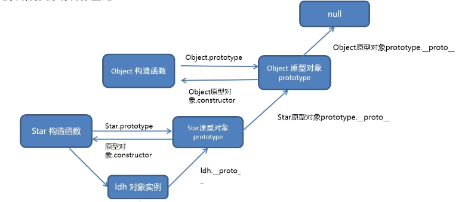

# Linux paltform

> 从archlinx中记录

通过document可以进行节点克隆。

```js
// element.cloneNode(boolean)
// true, 当前节点的子元素也会克隆
// false, 子元素不会克隆，默认值。
```

删除节点必须通过父元素进行删除。

```js
fatherNode.removeChild(sonNode)
```

M端事件（移动端事件），常见的三个事件为：

|event|description|
|----|----|
|touchstart|finger touch the element|
|touchmove|finger move on element|
|touchend|finger out the element|

> 通常M端事件都是通过插件来实现的，常用的插件为：swiper。尤其是轮播功能。
> 通常通过document进行操作都会有性能问题，所以在React框架中最好用ref。

### 延时函数
 延迟一段时间执行回调函数，只会调用一次。`setTimeout(callback, millisecond)`，但最好还是在后面进行清除：`clearTimeout(id)`

### 同步/异步

js为单线程语言，通常，同步任务是放在**执行栈**中，异步任务是放在**任务队列**中，通过回调函数执行。

当执行栈中的所有任务都执行完毕，才会调用任务队列中的异步任务。

```js
console.log(1)
setTimeout(fn, 0)
console.log(2)

// 执行栈
// console.log(1)
// console.log(2)

// 任务队列
// setTimeout(fn, 0)
```

**事件循环(event loop)过程**


通常异步任务是交给执行环境处理，一般是浏览器，或者node。

### location

> just means `window.location`

通常存储一些当前url相关的信息，因此可以通过修改对象上的url值实现页面跳转。

```js
// jump to baidu
location.href = 'https://www.baidu.com'
```

> 在url中添加#号，可以实现页面不跳转的spas应用（单页面网站）。例如https://www.baidu.com/#/no_jump

- reload(): 刷新页面，参数写入true，则强制刷新

### navigator

记录浏览器自身的信息，`userAgent`信息就存储在该对象中。

### history

记录浏览器地址栏的操作，实现类似前进后退的网页操作。

### 本地存储

实现页面刷新也不会导致数据丢失功能，将数据存储在浏览器中。容量较大。`sessionStorage`与`localStorage`约5M左右。

#### localStorage

作用：将数据永久存储在本地，除非手动删除。

特性：
- 多窗口（页面）共享（同一浏览器可以共享）
  > 不能够跨域，即百度网址存的东西在京东上的localStorage是看不到的。
- 以键值对的形式存储

```js
// set
localStorage.setItem(key, value)

// get
localStorage.getItem(key)

// remove
localStorage.removeItem(key)
```

#### sessionStorage

特性：
- 生命周期为关闭浏览器窗口
- 在同一各窗口（页面）下数据共享
- 以键值对形式存储
- 用法同localStorage相同

> 开发中少用`id`属性，能够用该属性的地方大部分应该都能够通过`ref`来代替

> **本地存储的所有数据都会被转化成字符串形式**

**存储复杂数据类型**

由于只能存储字符串，因此若直接存对象类型的数据将导致无法使用该数据——（在浏览器中会被同一转化成字符串`[Object Object]`）。

通常是将复杂数据转化成Json字符串形式进行本地存储。

```js
// JSON.stringify(object)
const obj = {pro: 1}
const jsonStr = JSON.stringify(obj)
localStorage('obj', jsonStr)

// conver json string to object
const jsonObj = JSON.parse(localStorage.getItem('obj'))
```

### JS 进阶

垃圾回收机制GC(Garbage Clollection)，JS内存分配周期。

- 内存分配：声明变量，函数，对象时
- 内存使用：使用变量，函数等内容时
- 内存回收：使用完毕，由**垃圾回收器**自动回收不再使用的内存

> 全局变量一般不回收，通常情况局部变量不用就回收。

> **内存泄漏**：程序未释放或无法释放某些内存。

**堆栈空间**分配区别：

栈（操作系统）：由**操作系统**自动分配释放函数的参数值，局部变量等，基本数据类型在栈里。

堆（操作系统）：一般由程序员分配释放，若程序员不释放，由**垃圾回收机制**回收。**复杂数据类型**放到堆里。

浏览器中常见的垃圾回收算法：**引用计数法**与**标记清除法**

#### 引用计数法

> 当前使用较少。

IE浏览器使用，定义内存不再使用是看一个对象是否存在指向它的引用。通过记录引用个数来决策。

**缺陷**：当两个对象相互引用（嵌套引用）时，垃圾回收机制无法回收。将导致内存泄漏问题。

### 标记清除法

> 现代大多数浏览器使用该算法

将不再使用对象定义为**无法到达对象**，从根部（全局对象）出发，定时扫描内存中的对象，能够到达的，则需要使用。无法到达的，则标记为不再使用。稍后回收。

### 闭包2

概念：一个函数对周围状态的引用捆绑在一起，内层函数中访问外层函数作用域。即**闭包=内层函数 + 外层函数的变量**。

```js
// 闭包作用：封闭数据，提供操作，外部访问函数内部变量。
// 只要内部函数使用了外部函数的变量，就会形成闭包。
// 开发中闭包的写法
function outer() {
  let i = 1
  function fn() {
    console.log(i)
  }
  return fn
}
const fun = outer()
fun()
```

> 闭包可能产生内存泄漏的问题。因为外层函数执行完后，理论上局部变量应该回收，但闭包原因，会让使用的变量不被回收。该回收的不回收，就会有泄漏风险。

### 函数

**动态参数**

```js
function getSum() {
  // 伪数组，只在函数中
  for (let i = 0; i < arguments.length; i++) {
    console.log(arguments[i])
  }
}
getSum(1)
getSum(1, 2)
getSum(1, 2, 3)
```

**剩余参数**

与动态参数的区别在于，剩余参数接受最末位的未定义型参位置的参数。且为真数组。

```js
// arr could be any name
function getSum(...arr) {
  // arr is a Array
  console.log(arr)
}

getSum(1)
getSum(1, 2)
getSum(1, 2, 3)
```

> 在不定参数情况下，尽量用剩余参数。

**展开运算符**

与剩余参数运算符写法相同，虽然打印展开运算符结果之间没有逗号，但实际上与有逗号隔开的结果是等价的。因此可以在某些情况下直接使用。如数组求最大值。

```js
let arr = [1, 2, 3]
console.log(...arr) // 1 2 3

// although the max is usually: Math.max(1, 2, 3)
console.log(Math.max(...arr))
```

#### 箭头函数

目的：更简短的函数写法，不绑定this，没有arguments（无法用动态参数）。

场景：替代原本使用匿名函数的地方。

**this**

通常，函数根据谁在调用它来定义自身的this属性，在对象中，嵌套的匿名函数就会出现this绑定错误问题。**而箭头函数不会自动创建this,只会从自己作用域链的上一层沿用this**。可以说箭头函数没有this。

但事件监听情况下，若要在回调函数中使用this,最好还是用普通的匿名函数。若为箭头函数，this通常指向来windows。

### 解构赋值

除了按序分配，可以跳值分配。

```js
const [a, , , d] = [1, 2, 3, 4]
// a = 1, d = 4

// 剩余参数与默认参数
const [a, ...b] = [1, 2, 3, 4]
// a = 1, b = [2, 3, 4]

const [a=0, b=0] = [1]
// a = 1, b = 0
```
**对象解构**

解构中，变量名与属性名相同，若出现变量名重复冲突，则通过冒号修改变量名。

```js
const {uname, age} = {uname: 'xxx', age: 18}

// if there are uname variable
const uname = 'som value'
const {uname: newName, age} = {uname: 'xxx', age: 18}
```

### 分号

某些必须要添加分号的情况。

```js
// some code before
(function t() {})();
// or
;(function t() {})()

// some code before
// swap two value
;[b, a] = [a, b]
// or
let a = value1
let b = value2;
[b, a] = [a, b]
```

### 构造函数

技术上是常规函数，但有两个约定：

- 命名以大写字母开头
- 通过“new”关键字来执行

new的四步操作。

1. 创建新对象
2. 构造函数this指向新对象
3. 执行构造函数代码，修改this,添加新属性
4. 返回新对象

```js
// create own new
function newFn(...args) {
  const constructor = args.shift()
  // const obj = {} 这样对象的构造器就是Object, 但应该为Person
  // 应为使用的是默认的Objec模板创建的对象，应该使用Person模板创建
  const obj = Object.create(constructor.prototype)
  const result = constructor.apply(obj, args)
  return typeof result === "object" && result !== null ? result : obj
}

function Person(name) {
  this.name = name
}

const p = newFn(Person, "Jerome")
```

**内置方法**

将伪数组转化成真数组：`Array.from()`，`toFixed()`可以定义数字类性保留的小数位数。`num.toFixed(2)`保留两位小数。

### 构造函数封装与相关问题

没有使用类的构造函数通常是用来封装公共的属性与方法。

**问题**：公共方法会存在浪费内存的问题——不同的实例化对象都会开辟自己的堆空间。

#### 原型

用于解决构造函数中存在的浪费内存问题——通过原型类分配函数。采用原型对象实现方法共享。

- 构造函数通过原型分配的函数是所有对象所**共享的**。
- 每一个构造函数都有一个**prototype**属性，指向另一个对象，也称该属性为原型对象。（自己理解的构造函数模板）
- 该对象可以挂载函数，对象实例化不会多次创建原型上的函数。
- **将不变的方法直接定义在prototype对象上，这样所有对象的实例就可以共享这些方法**。
- **构造函数与原型对象中的this都指向实例化的对象**。

例如：

```javascript
function Person() {
  this.name = "Ada"
}
console.log(Person.prototype)
/*
Object{
  constructor: Person()
  [[Prototype]]: Object
}
*/

// 定义公共的方法，注意不能使用箭头函数，这将导致this绑定为空对象。
Person.prototype.commonMethod = function() => {
  //...
}
```

> 注意大写的Prototype与小写的prototype是不一样的，小写的是可以显示的原型对象，大写实际上是__proto__对象原型在浏览器中的显示。

**constructor**

每个原型对象都会有一个constructor属性，指向原型对象的构造函数（即模板）——相当于互指。可以认为，构造函数为父系，原型对象为子系。互指可以明确是谁的原型对象，以及该原型对象的构造函数是谁。

> Object.create(proto), 使用proto作为新对象的prototype属性。

可以通过该属性重新指回创造这个原型对象的构造函数。

#### 对象原型

类似与构造函数存在原型对象prototype。每个实例化对象中也存在一个隐藏属性——对象原型（\_\_proto__），该属性指向构造函数的原型对象prototype。**对象原型指向原型对象**。

> \_\_proto__属性就是浏览器中看到到大写[[Prototype]]，应为第一种写法是非JS标准，所以浏览器中用后者替换，为只读属性。但代码操作需要用前者。


#### 原型继承

> 面向对象三大特性：封装，继承，多态

JS中继承是通过原型对象(prototype)实现的，因此常成为原型继承。

```javascript
// 非class的继承，原型继承——将公共属性放入原型对象
// 基本思想。
function Person() {
  this.head = 1
}
function Woman() {}

Woman.prototype = new Person()
Woman.prototype.constructor = Woman
Woman.prototype.newMethod = function () {}
const ada = new Womain()
ada.head  // 1
ada.newMethod()
```
#### 原型链与instanceof

通常原型链指的是对象原型的指向链——即一层层往上指。（只要是对象就会有对象原型）。最大原型对象为Object的，其对象原型指向空（`Object.prototype.__proto__ === null`）。



所谓的原型链就是一个属性查找路径，对象使用的属性会根据原型链的路径一层层向上查找。

由此，对象原型`__proto__`的意义就是给对象提供一个查找的方向。

`instanceof`就是检测一个构造函数的`prototype`属性是否出现在对象的原型链上。

### 深浅拷贝

针对引用类型。（引用类型采用赋值的操作给其他变量，所有变量都是共享的，其中一个改变，所有的都改变。为了解决该问题，引申出深浅拷贝）

**浅拷贝只拷贝地址**。常见的方法有

1. 拷贝对象：`Object.assgin()`, `{...obj}`
2. 拷贝数组：`Array.prototype.concat()`, `[...arr]`

```javascript
const obj = {
  uname: 'pink',
  comp: {first: 'abc'}
}
const o = {...obj}
// or const o = {}; Object.assign(o, obj)
o.uname = 'red'
o.comp.first = 'xxx'
console.log(o)//{uname:'red',comp: {first:'xxx'}}
console.log(obj)//{uname:'pink',comp:{first:'xxx'}}
```
对于基本类型的数据，浅拷贝可以实现两个对象的独立，但遇到复杂数据类型，依旧是拷贝的地址。

> 直接赋值是给地址，所有修改都是全局影响。但浅拷贝面对简单数据类型是相互独立的。

**深拷贝拷贝的是对象**。常见方法

1. 递归实现深拷贝
2. lodash/cloneDeep
3. 通过JSON.stringify()实现

```javascript
// 递归
const obj = {
  uname = 'pink',
  age: 18,
  hobby: ['hoby1', 'hobby2']
}
const o = {}

function shallowCopy(newObj, oldObj) {
  for (let k in oldObj) {
    newObj[k] = oldOjb[k]
  }
}
shallowCopy(o, obj)

// 但是，该代码复制的对象中不能有相互引用的情况，会导致无法结束递归。
function deepCopy(newObj, oldObj) {
  for (let k in oldObj) {
    // Array, must before Object
    if (oldObj[k] instanceof Array) {
      newObj[k] = []
      deepCopy(newObj[k], oldObj[k])
    } else if (oldObj[k] instanceof Object) {
      newObj[k] = {}
      deepCopy(newObj[k], oldObj[k])
    }
    else {
      newObj[k] = oldOjb[k]
    }
  }
}
deepCopy(o, obj)
```

**JS库lodash**

```js
// after install lodash
const obj = [{a: 1}, {b: 2}]
const deep = _.cloneDeep(obj)  // 采用递归实现
```

**JSON实现深拷贝**

```javascript
const obj = {/**/}
const midObj = JSON.stringify(obj)
const newObj = JSON.parse(midObj)
```

### 异常处理

**throw**抛出一个异常，并且中断程序运行。后面可以直接跟抛出的错误信息，但一般实例化一个错误对象来抛出。

```javascript
function fn(x, y) {
  if (!x || !y) {
    // short one:  throw 'no param passed'
    throw new Error('no param passed')
  }
  return x + y
}
fn()
```

捕获异常**try/catch/finally**。不会自动中断程序。不管前面是否捕获到异常，程序是否中断。**finally**中的代码都会执行。

**debugger**关键字相当于在浏览器中打了断点。用于调试程序。

### this总结

普通函数就是谁调用指向谁，没有明确调用者时，通常为`windows`。严格模式下没有调用者时就为`undefined`。

一般的对象是没有`this`的，只有函数才有。由于箭头函数自身没有`this`，因此在构造函数，原型函数，dom事件(如果需要`this`)等地方不推荐使用箭头函数。

> 在构造函数中，直接写的箭头函数`this`会绑定为该对象。

```javascript
function Person() {
  this.name = "leon"
  this.fun1 = () => {
    console.log(this)
  }
}
Person.prototype.fun2 = () => {
  console.log(this)
}

const p = new Person()
p.fun1()  // Person
p.fun2()  // window
```

### 防抖

定义：单位时间内，频繁触发事件，**只执行最后一次**。（在频繁触发时，后一次会取消前一次事件）

使用场景：类似用户最后一次输入玩后在进行验证，而不是输入一个字符就进行验证。

1. lodash库实现的防抖：`_.debounce()`
2. 手写防抖函数

```javascript
// normal use
domVar.addEventListener('eventName', _.debounce(callback, milisecond))
```

**手写防抖**

防抖的核心是通过定时器(`setTimeout`)来实现的。通过清除定时器操作来达到撤销前面事件的执行。

案例：鼠标滑动，则变量加1。在没有防抖时，滑动一像素就会出触发事件。性能消耗太大。设计防抖函数核心思路。

1. 声明一个定时器变量
2. 每当鼠标滑动，则判断是否有定时器，有定时器则清除前面的定时器（撤销前一面的事件处理）
3. 没有定时器则开启定时器。
4. 在定时器中调用执行事件的函数。

```javascript
// mouseMove is a callback function
function debounce(fn, t) {
  let timer
  return function () {
    if (timer) clearTimeout(timer)
    timer = setTimeout(function () {
      fn()
    }, t)
  }
}
domVar.addEventListener('mousemove', debounce(mouseMove, 500))
```

> 上面的案例中，鼠标停止滑动500毫秒后，才会执行事件处理函数。

### 节流 - throttle

节流：单位时间内，频繁触发事件，**只执行一次**。与防抖的区别在于，防抖是后面触发的事件来撤销前面正在执行的事件。而节流是当前面有事件在执行时，后来的事件会被撤销，以保证前面的事件能够完整的执行。

使用场景：高频事件（鼠标移动，页面尺寸缩放，滚动条滚动等）。

案例：同样是鼠标滑动让变量加1。节流实现为不管移动多少次，每隔500毫秒才会让变量加1。

> **防抖区别**，防抖版本中，鼠标不停止500毫秒，变量不会加一。节流版本中，鼠标不停，变量都会每隔500毫秒加一。

方案：

1. lodash节流函数：`_.throttle(func,[wait=0])`在wait毫秒内最多执行一次函数func
2. 手写节流函数

**手写节流函数**

核心依旧是通过定时器(setTimeout)来实现。流程如下

1. 声明一个定时器变量
2. 当鼠标滑动时，判断是否有定时器，**有则不开启定时器**
3. 没有定时器则开启定时器
   - 定时器里调用执行函数
   - **在定时器中将定时器清空**

```javascript
function throttle(fn, t) {
  let timer = null
  return function() {
    if (!timer) {
      timer = setTimeout(function() {
        fn()
        timer = null
      }, t)
    }
  }
}
domVar.addEventListener('mousemove', throttle(mouseMove, 500))
```

> **!!清空计时器函数并不会修改timer的值**

#### 节流应用

案例：页面打开，记录上一次的视频播放位置，涉及两个事件。

1. `ontimeupdate`事件在视频/音频当前的播放位置发生改变时触发
2. `onloadeddata`事件在当前帧的数据加载完成且还没有足够的数据播放视频/音频的下一帧时触发

思路

- `ontimeupdate`事件触发频率太高。设定每隔1s触发一次，记录当前时间到本地存储。
- 打开页面时，`onloadeddata`事件触发，从本地取回时间，设定成视频的播放位置。默认为0s
- 获取当前时间`video.currentTime`

```javascript
const video = document.querySelector('video')

video.ontimeupdate = _.throttle(()=>{
  localStorage.setItem('currentTime', video.currentTime)
}, 1000)

video.onloadeddata = ()=>{
  video.currentTime = localStorage.getItem('currentTime') || 0
}
```
