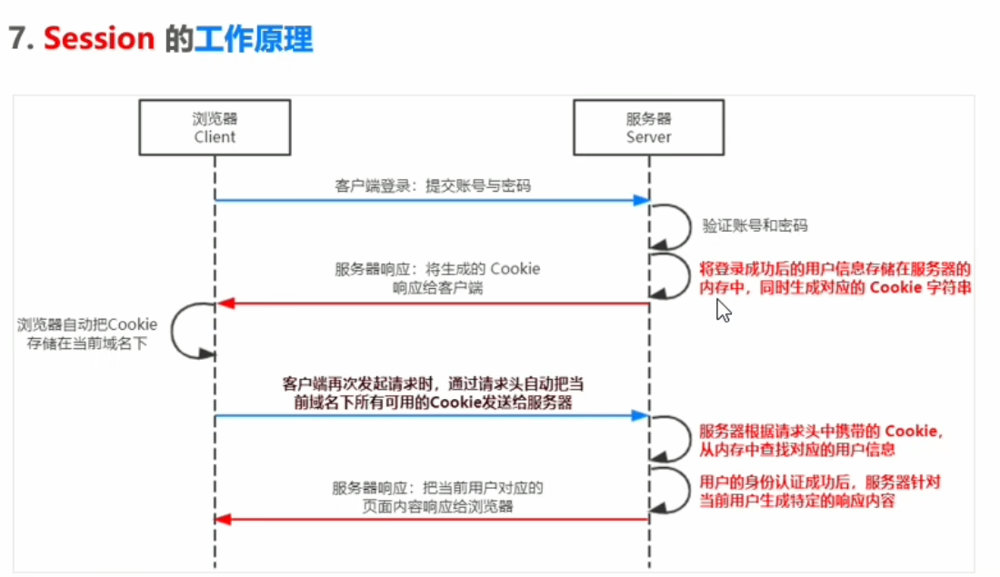
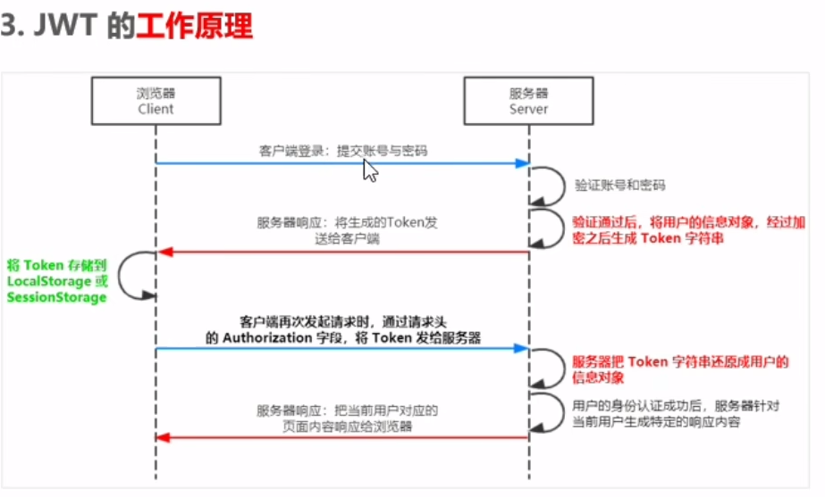

# 框架前置内容

一些nodeJs, webpack等内容。

> nodeJs就是用来做后端开发的运行环境。

fs模块使用相对路经时，容易出现路经动态拼接的问题。原因是node在运行时会以当前的路经作为工作路经，不会以文件路经作为工作路经，这样文件上的相对路经就会拼接到运行node时的路经上。

* * * *

- `path.join()`，将多个路经片段拼接

- `path.basename()`，从路经中解析出文件名

- `path.extname()`，返回文件扩展名

> `_dirname`当前的文件路经。不受node工作路经影响。

* * * *

**http模块**可以创建简单的Web服务器。

```js
const http = require('http')
const server = http.createServer()
server.on('request', function(req, res)=>{
  console.log('some one visit out web')

  // 设置编码与返回相应结果
  res.setHeader('Content-Type', 'text/html; charset=utf-8')
  res.end('some result')
})
server.listen(80, function(){
  console.log('server run at http://127.0.0.1')
})
```

* * * *

JS中模块的分类

- 内置模块（官方提供，如fs, path）

- 自定义模块（用户创建的每个js文件）

- 第三方模块

通过`require`加载模块，**通过该方法加载时，会执行对应模块的代码**，也就是说，模块中如果不是纯函数与方法，有某些运行的代码，都会被执行。

**模块作用域**：不同模块之间的变量是相互独立的。若需要向外共享模块作用域中的成员，需要使用`module`对象。

```js
// in file1.js
module.exports = {
  // some thing need export
}

// in file2.js
const m = require('file1') // {}
```
> 实际上就是获取`module.exports`指向的对象，以最后的指向为准。

为了方便编写，node提供`exports`对象，类似`module.exports`的别名。这两最初指向的是同一个对象。但同时使用时，可能导致两者指向不同的对象。

当两者同时使用时，`require`最终得到`module.exports`指向的对象。

**因此，最好之用一个**。

* * * *

### 模块规范

NodeJS遵循CommonJS模块化规范，该规范规定了**模块的特性**和**各模块之间如何相互依赖**。

_CommonJS_

1. 每个模块内部，`module`变量代表当前模块

2. `module`变量是一个对象，其`exports`属性是对外的接口

3. 通过`require()`方法加载某个模块的对外接口

**加载机制**：第一次加载模块后，就会放入缓存，若重复加载该模块，就会直接从缓存中拿。**内置模块**加载机制最高，同时**自定义模块**必须用相对路径。

加载模块时，node尝试的过程。

1. 按输入的文件名查找

2. 依次补全`.js`, `.json`, `.node`扩展名查找

3. 加载失败则返回错误

* * * *

### Express

基于nodeJS的建议Web开发框架，基于http模块进行的封装。直接通过`npm`安装即可。

```js
const express = require('express')
// create a web server
const app = express()

// config get and post
app.get('/user/:id/:name', (req, res)=> {
  // return json obj
  res.send({name: 'username', age: 20})
})
app.post('/user', (req, res)=>{
  res.send('req success')
})

// if start a server, print some info
app.listen(80, ()=>{
  console.log('express server runnint at http://127.0.0.1')
})
```

托管静态资源——将`public`文件夹下的文件设定为可访问的静态资源。

```js
app.use(express.static('public'))
```

* * * *

**创建额外的路由模块**

```js
// in router.js
const express = require('express')
const router = express.Router()

router.get('/', (req, res)=>{})
router.post('/', (req, res)=>{})

module.exports = router

// in server.js, registe route
const router = reuqire('./router')
app.use(router)

// 添加统一访问前缀
app.use('/api', router)
```

`use`方法常用来调用Express的中间件——当一个请求到达Express服务器时，会先通过不同的中间件进行处理后再返回响应。

实际上中间件就是一个处理函数，与路由处理函数只多了一个参数。

```js
// 路由处理函数
function (req, res) {}
// 中间件
const md = function (req, res, next) {
  // 将请求流交递给下一个中间件或路由
  next()
}
// 全局生效
app.use(md)
// 局部生效
app.get('/user', md, (res, req)=>{})
```
> 上下游的中间件是共享同一份req与res。且中间件要在路由之间注册。

**CORS**问题——通过使用第三方中间件`cors`实现配置。实际上就是设置一些响应头。

CORS响应头部：

- `Access-Control-Allow-Origin`：设置允许来自那些域名访问请求。

- `Access-Control-Allow-Headers`：默认情况下，服务器允许的响应头类型是固定的，若需要接受额外的，许要配置。

- `Access-Control-Allow-Methods`：默认情况下，CORS仅支持客户端发送GET, POST, HEAD请求。

### 认证机制

#### session

适用于服务器渲染的项目。基于`cookie`实现。单独使用cookie认证是不具备安全性的。进一步的提高安全性就是`session`。

**工作原理如下**



> Express 项目中可以使用第三方中间件`express-session`

```js
const session = require('express-session')
app.use(session({
  secret: 'set any char',
  resave: false,
  saveUninitialized: true
}))

app.post('/api/login', (req, res)=>{
  if(req.body.usename xxxx) {
    // failed
  }
  // success, set session
  req.session.user = req.body
  req.session.islogin = true
  res.send({status: 0, msg: 'success'})
})
```

#### jwt

适用于前后端分离的项目。Session认证的局限性：需要配合cookie才能够实现，而cookie默认不支持跨域，所以涉及到*前端跨域请求后端接口*时，需要许多额外配置。

**所以，当前端需要进行跨域请求后端的时候，最好使用jwt(JSOn Web Token)**。

**工作原理**



> 通过服务器生产Token字段，本地存储Token，后续访问带上Token。

JWT由三个部分组成：Header, Payload, Signature。其中，**Payload**部分是**真正的用户信息**，通过加密后的用户字符串数据。**Header, Signature**是安全性相关部分。

```js
// Token
Header.Payloadl.Signature
```

**使用**

客户端收到JWT后，通常存储在`localStorage`或`sessionStorage`中。在之后的通信中，通常将JWT放在HTTP请求头的**Authorization**字段中。

```js
Authorization: Bearer <token>
```

**Express中使用JWT**

通过`jsonwebtoken`与`express-jwt`这两个包来实现。前者用来生成JWT字符串，后者将JWT字符串解析还原成JSON对象。

为了保证传输的安全性，需要定义各一用于加密与解密的secret密钥。这样即便Token被盗，用户信息丢失的风险也会降低。通常是开发人员定义的一个长字符串。


```js
const jwt = require('jsonwebtoken')
const expressJWT = require('express-jwt')

// secret
const secretKey = 'just_a_long_string'

// 在登陆成功后的代码中
// 参数一，用户信息
// 参数二，加密密钥
// 参数三，配置对象，可设置有效期。
const token = jwt.sign({
  username: 'username',
  secretKey,
  {expiresIn: '30s'}  // 30秒有效
})
res.send({
  status: 200,
  message: '登陆成功',
  token: token
})
```

还原解码过程通过全局中间件实现，`unless`为不需要认证的接口。

```js
app.use(expressJWT({secret: secretKey}).unless({path: [/^\/api\//]}))
```
> 由于是三方库，所以在实际开发的时候需要查看当前最新的文档，上面的代码可能大部分都是一前的属性了。

> 通常Token加密数据中不会放入用户密码。

* * * *

**数据库相关**

Express框架可以通过`mysql`库与数据就建立联系（但应该过时了，需要查找新的）。同时密码可以通过`bcryptjs`进行加密处理，该包对于密码加密后无法被逆向破解，且每次加密结果不一样。

表单数据验证：`@escook/express-joi`, `@hapi/joi`