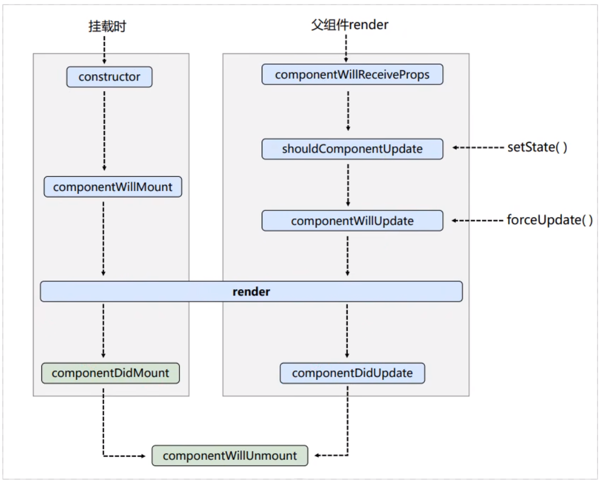
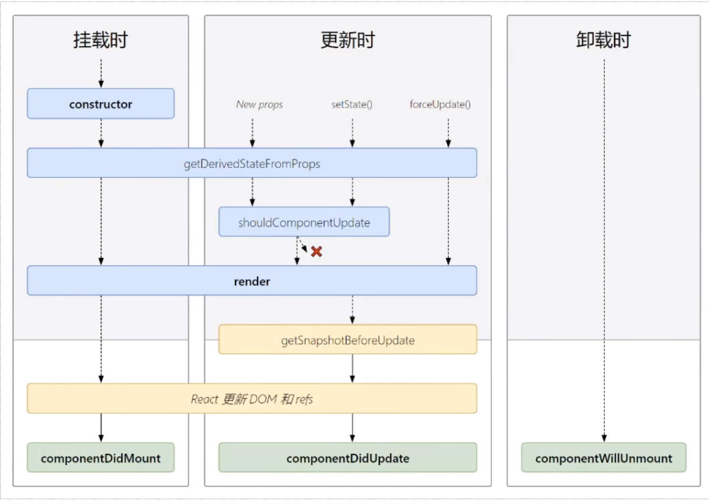
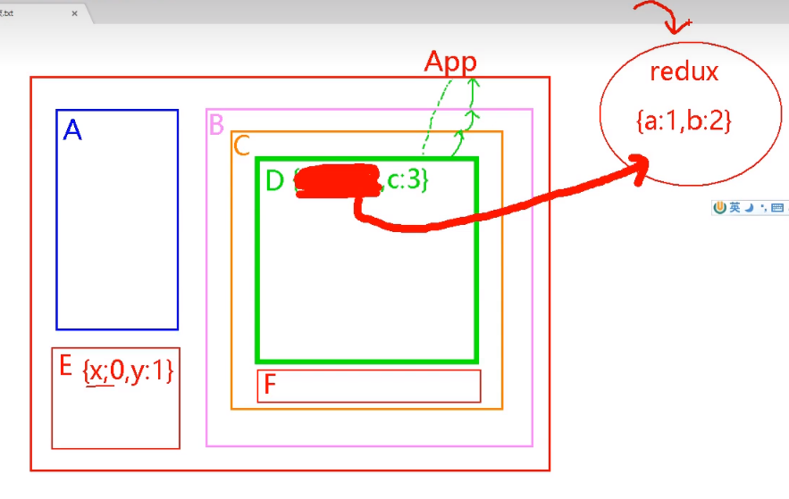
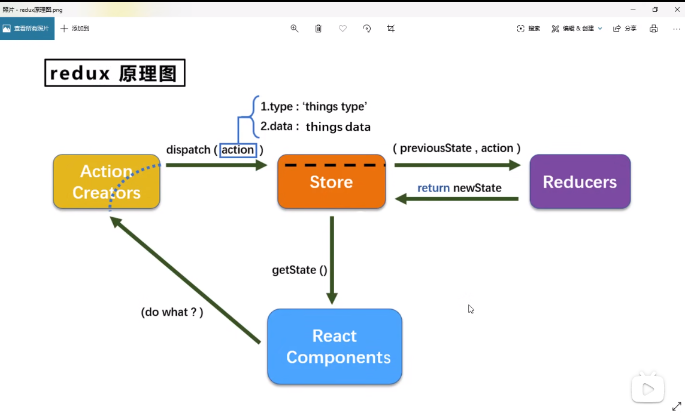
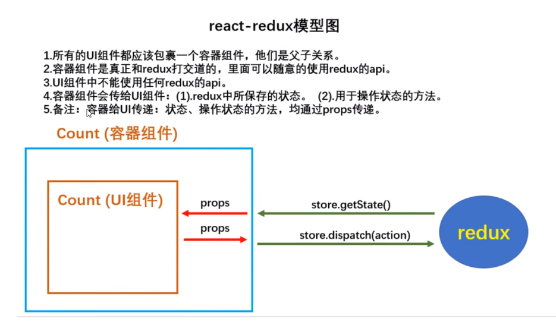

# ReactJS

> 记录React学习过程中的一些难点

React特点

1. 采用**组件化**模式、**声明式编码**，提高效率与组件复用率。
2. 使用**虚拟DOM**+优秀的**Diffing**算法，尽量减少与真实DOM的交互。

**虚拟DOM**（就是一个js对象）

在拿到数据时，React先将数据声成虚拟DOM，并与原本的虚拟DOM进行比较，与原本相同的数据就不会重新生成**真实DOM**，只会将原本没有的数据生成真实DOM。

> 在jsx中写的html节点就是虚拟DOM，通常原生的js是没法直接写虚拟DOM的，但 自己的项目中也写了，应该是后台默认转化了，如果在html文件中写js脚本是无法这么写的。

**babel.js**: 一个转化文件，能够就将ES6规范转化成ES5。也能够将jsx转化成js，浏览器只认js。

> XML主要是早期传送数据用的格式，现在主流应该是JSON.

**!!!在虚拟DOM中，大括号(`{}`)内只能写JS表达式，这也就是为什么在写自己项目的时候没法用if语句的原因了**。

> JS表达式，通常是那些写在等号右边的代码。

**Diffing算法**

该算法依赖组件上的`key`属性，每个`key`属性认为是独立的。类似`id`。这也是官网上提到过可以通过修改组件的`key`来重新渲染该组件。

### 组件

定义：代码与资源的结合。通常使用了`state`的组件为复杂组件，没有使用的为简单组件。

#### 函数组件

适用于定义简单组件。

#### 类组件

适用与定义复杂组件。

#### 三大核心属性

> 默认是通过**类**定义的属性。React18中`useState`是属于在函数组件中实现类式组件的功能。

----

1. **state**

用于存储显示在页面上的数据。状态组件写法

```javascript
class MyComponent extends React.Component {
  constructor(props) {
    super(props)
    this.state = {} // initial state, should be a object
  }
  render() {}
}
```

函数组件中，事件`this`的问题，由于React中事件监听的回调函数是以赋值的方式传递，最终调用类中函数的对象不再是实例化对象，所以需要创建绑定好`this`对象的函数。

```javascriptreact
class Weather extends React.Component{
  constructor(props) {
    super(props)
    this.state = {isHote: false}
    // 加上这一句就可以解决下面注释说的问题
    this.changeWeather = this.changeWeather.bind(this)
  }
  render() {
    const {isHot} = this.state
    return <h1 onClick={this.changeWeather}>hot {isHot ? 'yea' : 'no'}
  }
  changeWeather() {
    // 由于事件绑定是以函数赋值方式传递，所以触发事件时this会丢失，不会指向Weather对象。
    console.log(this)
    this.setState({// 同名替换，其他不变
      isHote: !this.state.isHote
    })
  }
}
```
> 类中的方法默认都是严格模式

通常，如果只是初始化状态，可以不用写构造函数。如下为精简版

```javascriptreact
class Weather extends React.Component{
  state = {isHote: true}
  render() {
    const {isHot} = this.state
    return <h1 onClick={this.changeWeather}>hot {isHot ? 'yea' : 'no'}
  }
  changeWeather = () => {
    this.setState({
      isHote: !this.state.isHote
    })
  }
}
```

精简版中，`state`直接写成成员变量，`changeWeather`也以成员变量的形式给出，这样该函数就不是在类的原型对象上，而是直接在实例对象上。同时使用箭头函数，当直接调用该函数时，会继承外面的`this`，也就是实例化对象。

* * * *

2. **props**

从组件外传入数据给组件内部。在组件内部为只读属性。

```javascriptreact
class Person extends React.Component{
  render() {
    this.props.name // ada
  }
}
// 下面两个可以放到类中的静态属性上
// 对于属性的类型进行限制，需要PropTypes包
Person.propTypes = {
  name = PropTypes.string.isRequired // 必传字符串
}
// 属性默认值
Person.defaultProps = {
  sex: 'man'
}
const obj = {name: "1", second: 2}
<Person name="ada" />
<Person {...obj} />  // 批量传递
```

> 再一次，类式组件的构造器能不写就不写。官网的描述也是仅用于`state`初始化，与设置绑定`this`的事件回调函数

* * * *

3. **ref**

效果同`useRef`，就是对某个Dom元素的引用。在中使用方法为

```javascriptreact
class Demo extends React.Component {
  thirdTag = createRef()
  showDate = () => {
    console.log(this.refs.myName)
  }
  render() {
    return (
      <div onClick={this.showDate}>
        <div ref="myName"></div>
        <div ref={(tag)=>{this.myTag = tag}}></div>
        <div ref={this.thirdTag}></div>
      </div>
    )
  }
}
```

按照官网的建议，字符形式的`ref`最好是不要在使用，在某些情况下会出现性能问题。并且后续版本可能会删除。最好采用回调形式的`ref`。

回调形式的`ref`执行次数：如果回调函数以内联的形式写在标签上，那么在更新组件的阶段(第一次渲染不会)会调用两次内联回调函数。第一次为`null`。第二次为具体的标签。可以将回调函数写在类里面就可以只调用一次。或者使用最新的函数`createRef`。

> 但是到了React18开始，应该是推荐使用函数式组件。但还会尽量少用`ref`。毕竟要大量存储Dom内容。

### 收集表单数据

包含表单的组件分类：

1. 受控组件：通过`onChange`事件获取数据，并利用回调函数将数据存储到`state`中
2. 非受控组件：表单中所有输入类组件，数据现用现取。通过`ref`获取数据，数据本身没有存储

```javascriptreact
// 非受控组件表单
return (
  <form onSubmit={this.handleCallback}>
    <input ref={this.myRef} type="text" name="user" />
  </form>
)

// 受控组件表单
return (
  <form onSubmit={this.handleCallback}>
    <input onChange={this.handleChange} type="text" name="user" />
  </form>
)
```

> 通常情况下，能够写受控组件就写受控组件(类似Vue中的双向绑定)，能够避免使用大量的`ref`。

#### 函数柯里化/高阶函数

在受控组件中，每个输入项都会接受一个回调函数，用于将数据存入状态中，若每个组件都写一个函数，那么就会出现大量相似的函数。通常将这些函数抽象成一个总体函数，通过参数来控制存储不同的状态信息。


```javascriptreact
class Demo extends React.Component {
  saveFormData = (dataType) => {
    return (event) => {
      // data value
      // 不能直接写dataType,这样会默认把他当成字符常
      // 需要读取变量
      this.setState({[dataType]:event.target.value})
    }
  }
  render() {
    return (
      <form>
        <input onChange={this.saveFormData('firstInput')} />
      </form>
    )
  }
}
```

> **！！！注意**，JS的对象写法中，`key`的值都是默认转成字符串的，若需要读取变量的值需要添加中括号。

**高阶函数**：若函数接收的参数为函数，或者返回值是一个函数，则该函数为高阶函数。

**函数柯里化**：通过函数调用继续返回函数的方式，实现多次接受参数，最后统一处理的函数编码形式。

_上述案例就应用里高阶函数与函数的柯里化_。

* * * *

### 组件的生命周期

就是之前在老版的官网看到的三个成员函数：`componentDidMount`, `componentDidUpdate`, `componentWillUnmount`。同样的函数式组件使用的`useEffect`相当于实现上面三个方法的功能。

> 每次渲染都是调用`render()`方法。但前最新的官网介绍中，前三个方法都是过时方法。

旧版React的生命周期图（React16版）



旧版图中，左侧为第一次加载组件，右侧为组件更新，分三条线：（1）通过设置状态更新。（2）通过强制更新函数强制更新。（3）父组件更新，出发自身更新。

> `shouldComponentUpdate`返回一个布尔值，为真则触发后续更新，为假则阻断更新。

新版React生命周期（React17版）



在新版本的React中，计划弃用三个常被误用的钩子函数。同时提出了两个新的钩子。

- `componentWillMount`
- `componentWillUpdate`
- `componentWillReceiveProps`

新增的两个钩子（实际上React18推荐函数组件，新增的也过时了。即与类组件相关的都算过时）。

- `getDerivedStateFromProps`：静态方法，返回值用于更新`state`值。通常只用于非常罕见的案例——`state`的值依赖于`props`中的值。
- `getSnapshotBeforeUpdate`：更新前获取快照，返回一个`null`或快照值（任意数值类型）。返回值将传递给`componentDidUpdate`。某些UI场景可能需要使用。


### Diffing算法

状态更新，导致重新调用`render`进行渲染时，并不会把整个组件都重新在网页上进行替换，而是对比数据，只将数据变动的部分修改。最小单位为一个标签节点。

那么对比过程中，属性`key`就比较关键了，也是经典的面试题目。通常的问法。

1. react/vue中的key有什么作用？（key的内部原理是什么）
2. 为什么遍历列表时，key最好不要用index？

* * * *

**虚拟DOM中key的作用**：

简单说：key是虚拟DOM对象的标识，在更新显示时key起着重要的作用。

详细说：当状态中的数据发生变化时，React会根据「新数据」生成「新的虚拟DOM」，随后React进行「新虚拟DOM」与「旧虚拟DOM」的diff比较，比较规则如下：

1. 「旧虚拟DOM」中找到了与「新虚拟DOM」相同的key

   - 若「虚拟DOM」中内容没变，直接使用之前的真实DOM
   - 若「虚拟DOM」中的内容变了，则生成新的真实DOM,并替换页面

2. 「旧虚拟DOM」中未找到与「新虚拟DOM」相同的key，则根据数据创建新的真实DOM，并渲染页面

* * * *

**用index作为key可能引发的问题**

1. 对数据进行逆序添加、逆序删除等破坏顺序操作，会产生没有必要的真实DOM更新（界面效果没问题，但效率低）

2. 如果结构中还包含输入类DOM：会产生错误DOM更新（界面有问题）

3. **注意**！如果不存在对数据的逆序添加、逆序删除等破坏顺序的操作，仅用于渲染列表，使用index作为key是没有问题的

```html
<!-- old virtual dom -->
<li key=0>小李<input type="text"/></li>
<li key=1>小张<input type="text"/></li>

<!-- new virtual dom -->
<li key=0>小王<input type="text"/></li>
<li key=1>小李<input type="text"/></li>
<li key=2>小张<input type="text"/></li>
```

上面的代码中，逆序添加了一条数据，将导致三条数据都重新渲染，但是，Diff算法比较内部的`<input/>`标签时发现没有改变，就会沿用上一次的内容，而这将导致原本小李的输入框会放到小王身上，这样输入框的内容就与前面的名字不对应了。

* * * *

**开发中如何选择key**

1. 最好使用每条数据的唯一标识作为key，比如id、手机号、身份证、学号等

2. 如果确定只是简单的展示数据，也是可以用index的。

### 脚手架

`create-react-app`创建的项目通常由React, webpack, es6, eslint构成。

### 3月27

在开发过程中，通常第三方的库放在顶端，自己的中间，最后为样式。

#### react ajax

在react中集成**ajax**时有两种方法，通过三方库，或自己封装。（通常都是三方库）

常用的ajax请求的库有：

1. jQuery，比较重，如果需要重新引入，则不建议使用该库

2. axios，轻量级，通常是react应用的选择。

   - 封装`XmlHttpRequest`对象的ajax
   - `Promise`风格
   - 可以用在浏览器端和`node`服务器端

前后端分离的时候使用`ajax`进行请求就会面对跨域问题。通常的解决方式为通过`webpack`设置代理进行转发。（通常跨域问题是`ajax`引擎进行了拦截，跨域请求是可以发送的，但是不能接收）

* * * *

###### 第一种方式

**package.json**文件中

```json
{
  "proxy": "http://server.address:port"
}
```

> 随后，在`axios`请求中，把域名修改成前端服务器的域名。同时，代理并不会把所有资源都转发，只会把在前端域名上找不到的时候，才向后端服务器请求。

* * * *

###### 第二种方式

但是，当需要请求多个服务器信息时，第一种方法就无法实现，因为只能写入一个转发服务器。React脚手架提供第二种方式进行代理设置。通过文件`src/setupProxy.js`进行设置，且不能用ES6语法，得用CJS语法。

```javascript
const proxy = require('http-proxy-middleware')

module.exports = function(app) {
  app.use(
    proxy('/api1', {
      target: 'http://server.address1:port',
      changeOrigin: true,
      pathRewrite: {'^/api1': ''}
    })，
    proxy('/api2', {
      target: 'http://server.address2:port',
      changeOrigin: true,
      pathRewrite: {'^/api2': ''}
    })
  )
}
// get server data
// axios.get('http://localhost:3000/api1/somedata')
// get local data
// axios.get('http://localhost:300/somdata')
```
上面的代码中通过第三方插件来实现代理——实际上第一中方式也是使用这个插件进行代理。文件描述为当请求路径中出现`/api1`时，使用代理将请求向目标转发。但需要在转发时将`/api1`进行删除，因为服务器请求也没有这个文件，除非服务器有就不需要。`changeOrigin`是控制服务器收到的请求头中Host字段的值。默认为不开启，Host字段依旧为前端拉起的域名。开启则会修改成服务器域名。

> 第二种方法能够代理多个服务器，且能手动控制是否走代理

#### 消息订阅与发布机制

主流的工具为`PubSubJS`。用于组件之间是信息交互。才用原生的React进行编码时，组件之间通信只能通过`props`, `state`及相关回调函数进行，同时兄弟组件之间没法直接通信，需要借助父组件。

`PubSubJS`则是类似Electron的IPC机制，在某个通道上进行消息的订阅与发布。

* * * *

#### fetch发送请求

通常JQuery, Axios都是对ajax——XHR(XMLHttpRequest)对象的封装，属于三方库。但`Windows`内置一个`fetch`方法，也是`Promise`风格，能够进行服务器请求。

特点：

- 原生函数，不再使用XmlHttpRequest对象提交ajax请求

- 老版浏览器可能不支持

* * * *

#### SPA

通过React等框架编写的应用通常都是SPA(single page application)应用。即点击链接不会进行页面刷新，只会进行局部的组件更新。数据通过ajax获取，在前端通过异步展现。

* * * *

#### React路由

前端路由的原理就是在后台有个程序在检测URL的变化，同时进行匹配，以展示对应的组件。

前端路由的本质就是一个键值对的映射关系，通常为`{key: value}`，即`{path: component}`，一般情况下，`path`是根目录之后的内容，前面的`http`这些东西都是忽略的。

前端路由内部是通过浏览器的`history`来实现支持的。——该对象实际上到H5才推出了操作该对象的API。

> React路由有三个实现的库，在Web应用上采用的是`react-router-dom`

通常情况下，通过路由控制的组件一般放在`pages`文件夹中，而不是放在`components`文件夹中。

但最重要的区别是，一般组件默认是没有`props`传入的。但路由组件中会默认收到路由器传递的三个默认`props`值。（理论上就只有三个默认的）

> 路由匹配过程中默认为模糊匹配，就是路由中的路径必须全部在给出的链接中，至于链接后面是否有多余的内容，则无关紧要。例如下面就是模糊匹配成功。

```javascriptreact
<Link to="/home/a/b">HOME</Link>

<Route path="/home" component={demo} />
```

路由匹配总是从最先注册的路由开始，因此在多级路由的时候，下面的路由一定要带上父路由。即`/home`下面的子路由中需要带上`/home`，即`/home/subRoute`形式。

向路由组件传递参数，通过在注册路由时声明传递的参数，在跳转链接中添加参数，就能够将参数传递到路由组件默认的三个`props`之中。通常在`props.match.params`。

```javascript
// 传递param参数
<Link to={`/detail/${obj.id}/${obj.name}`}>Detail</Link>

<Route path="/detail/:id/:title" component={Detail}/>
```

* * * *

第二中传递参数的方式，`search`参数。这种方法无需在注册时声明。数据存在`props.location.search`中。但得到的是`urlencoded`字符串——键值对之间通过`&`进行分隔，就像GET请求一样。

```javascriptreact
// 传递search参数
<Link to={`/detail/?id=${obj.id}&?title=${obj.name}`}>Detail</Link>

<Route path="/detail" component={Detail}/>
```

* * * *

第三种方法，传递`state`参数，这个方法与前面的不同，传递的内容在地址栏是不显示的。同样路由注册无需声明。

```javascriptreact
// 传递state参数
<Link to={{pathname:'/detail', state:{id:xx,title:xx}}}>Detail</Link>
```
数据通常存储在`props.location.state`中，且为一个对象，能够直接使用解构赋值。

> 使用第三种方式传递时需要考虑浏览器历史记清空问题，因为路由是通过`history`维护，虽然使用`state`传递参数时地址栏没有信息，但后台有维护，若清空历史记录，则后台数据丢失。代码就会取不到值，因此编码的时候要考虑这一点。设置一些默认值。

> 注意，这里的`state`不是组件里的属性`state`。

* * * *

默认的路由模式都是`push`模式，每条链接都会留下痕迹。在`Link`标签中介入`replace`，同开启严格模式。

* * * *

**自动跳转**：由于React路由是通过`history`对象维护的，因此路由组件携带了一些该对象的API，可以通过这些API实现自动链接跳转(`history.push()`, `history.replace()`)

> push方法会留下痕迹，可以回退，replace方法不会留下痕迹。

* * * *

为了让一般组件使用路由组件的`props`，可以通过`withRouter`函数实现（这不是个组件）。在导出普通组件的时候通过该函数加工。

```javascriptreact
export default withRouter(NormalComponent)
```

* * * *

**BrowserRouter**与**HashRouter**区别

1. 底层原理不同：BrowserRouter使用的是H5的history API，不兼容IE9及以下版本。HashRouter使用的是URL的哈希值。

2. path表现形式不一样：BrowserRouter的路径中没有#，HashRouter中包含#号。

3. 刷新后对state的影响：BrowserRouter没有影响，**HashRouter**刷新后会导致路由state参数丢失。

4. **HashRouter**可以用于解决一些路径错误相关的问题。

### redux

1. redux是一个专门用于做**状态管理**的JS库。

2. 可以用在react, angular, vue等项目中，但基本与react配合使用

3. 作用：集中管理react应用中多个组件**共享**的状态

在多个组件中需要共享某些状态时，相对于每个组件进行订阅发布就有些麻烦，这时候通过redux来管理这些共享变量就方便许多。



使用redux的两种情况

1. 某个组件的状态需要然其他组件随时拿到（共享）

2. 一个组件需要改变另一个组件的状态（通信）

3. 总体原则：能不用就不用

**工作原理图**



`action`在图中表现为对象形式，实际上，分两种类型。

1. `action`类型为`Objext`，则为同步`action`

2. `action`类型为`Function`，则为异步`action`

* * * *

然而，由于大量的React应用都使用的Redux库，因次，React团队就推出了React的插件`react-redux`，能够更好的在React应用中使用Redux。模型图如下



* * * *

###### 纯函数

一些纯函数的约束

1. 不得改写参数

2. 不会产生任何副作用，例如网络请求，输入输出设备等

3. 不能调用`Date.now()`或者`Math.random()`等不纯的方法

> 在React18中，基本常见的hook都是设计成传入的函数为纯函数

* * * *

### Context

通常用于祖孙组件之间的通信。不过前面已经有两消息订阅与发布，redux。这中方法应该用的少。（能够在函数与类组件之间进行数据传递，只不过函数的接收要麻烦一点）

> 开发中一般不用，都是用来封装react插件。

* * * *

### Component

该继承的组件是存在两个问题的。

1. 只要执行了`setState()`函数，即便啥也没变，也会重新渲染

2. 当前组件重新渲染了，就会自动渲染子组件····效率低

> 该情况同样适用与函数式组件，但是，函数式组件在检测到后续的状态都没有改变时就不会重新渲染，但首次介入没有修改状态的设置状态函数时依旧会调用自己的渲染，但不会渲染子组件。而每次改变状态，子组件都会重新渲染

**原因**：`Component`中的`shouldComponentUpdate()`总是返回`true`，这就导致永远会重新渲染。

* * * *

###### 方法一

如果是类组件，则可以重写`shouldComponentUpdate`方法，手动判断是否需要更新。但这样的方法面对状态变量多时就不好用，且实际开发中少有改写该方法的。

* * * *

###### 方法二

如果是类组件，可以使用`PureComponent`来代替`Component`。函数式组件则可以使用`React.memo()`，在导出组件的时候用该方法包裹组件，会记录包裹的组件收到的`props`是否发生改变，没有改变就不会重新渲染。

* * * *

### renderProps

当组件之间的父子关系是通过标签体形式存在时，无法直接向子组件传递属性，需要通过组件上的属性进行回调。

> 注意，A组件的属性`render`是可以任意命名的，之后声明与调用的名字一样就可以。

```javascriptreact
class App extends Component {
  render() {
    return (
      <div>
        <A render={(name)=><B name={name}>} />
      </div>
    )
  }
}

class A extends Components {
  state = {name: 'tom'}
  render() {
    return (
      <h1>A component</h1>
      {this.prorps.render(name)}
    )
  }
}

{/* show tom in B component */}
class B extends Components {
  render() {
    return (
      <div>{this.props.name}</div>
    )
  }
}
```

* * * *

### ErrorBoundary

错误边界：由于前后端的分离，那么就会出现后端数据与前端写的数据结构不对等的问题，当出现这种情况的时候， 需要能够正确的展示未出错的组件，同时在出错组件上展示一段提示。同时能够将错误控制在对应的组件。

通常的做法是在容易出错组件的父组件上设置错误边界。类组件的做法为使用`static getDerivedStateFromError`。该方法是当子组件出现错误时，被调用。

```javascriptreact
class Parent extends Component {
  state = {hasError: ''}
  static getDerivedStateFromError(error) {
    return {hasError: error}
  }

  render() {
    return (
      <div>
      {this.state.hasError ? <h2>balabala</h2> : <Child />}
      </div>
    )
  }
}
```

同时会配合`componentDidCatch`方法统计错误，将信息发送给服务器后台。

> **注意，只能捕获生命周期中产生的错误**。

* * * *

组件之间的通信方式总结：

1. props

2. 消息订阅与发布：pubs-sub、event等

3. 集中式管理：redux、dva等

4. context

   - 生产者-消费者模式
  
**一般采用的搭配方式**：

- 父子组件：props

- 兄弟组件：消息订阅-发布、集中式管理

- 祖孙组件（跨级组件）：消息订阅-发布、集中式管理、_context_(开发用的少)

* * * *

### React-Router 6

当前最新版的路由组件。函数式组件时代的开端。同样的，为了使用react的路由进行导航，那么对应的链接就必须用`react-router-dom`中的组件进行编写，与5版本的相同，分为`Link`与`NavLink`——有高亮与没有高亮。

在6版本中，重定向组件修改成`Navigate`，该组件一渲染就会引起试图切换。

`NavLink`修改高亮现在需要在`className`上添加一个回调函数，用于返回应用在链接上的样式，回调函数接受一个参数，里面描述该链接是否是被点击的。

```javascript
<NavLink className={({isActive})=>isActive? '' : 'active'} to="/home">Home</NavLink>
```

* * * *

#### 路由表

6版本新增的Hook——`useRoutes`。能够将`Route`所注册的路由集中管理。

```javascriptreact
<Routes>
  <Route path="/home" element={<Home />} />
  <Route path="/about" element={<Aboud />} />
</Routes>

{/*collect with useRoutes*/}
const element =  useRoutes([
  {
    path: '/home',
    element: <Home/>，
    children:[
      {
        path:"/detail"
        element:<Detail/>
      }
    ]
  },
  {
    path: '/about',
    element: <About/>
  }
])
```

通过路由表收集后，上面的注册路由就不需要写了。只要把`{element}`放到相应的位置就可以。同时，子集路由无需带上父级路由前缀。而子级路由匹配中后，显示的位置需要使用`Outlet`组件进行标记——即`<Outlet />`放在哪里，子级路由显示在哪里。但得在同一组件中。

* * * *

#### 接受参数

路由5中，都是写的类组件，传递的参数都是在`props`中，升级到6后，大多为函数组件，传递参数就需要使用额外的Hook。

- `useParams`：返回接受到的param形式的参数

- `useSearchParams`：返回接受到的search形式参数，返回形式类似`useState`，对第一个返回变量调用`get(key)`获取对应的value值。

- `useLocation`：返回`location`对象，里面有`state`。

  > 6版中，state方法要参数传递要简便一点。查看官网Link内容

* * * *

在5版本的编程式路由导航中，可以通过`history`属性进行页面跳转，6版本中函数组件没有该属性，通过`useNavigate`Hook进行实现。该方法返回的对象能实现类似`histroy`的功能。但功能没那么全。

```javascriptreact
const nav = useNavigate()

nav('/home') //go to home page
nav('/home', {})//go home with some config
```
